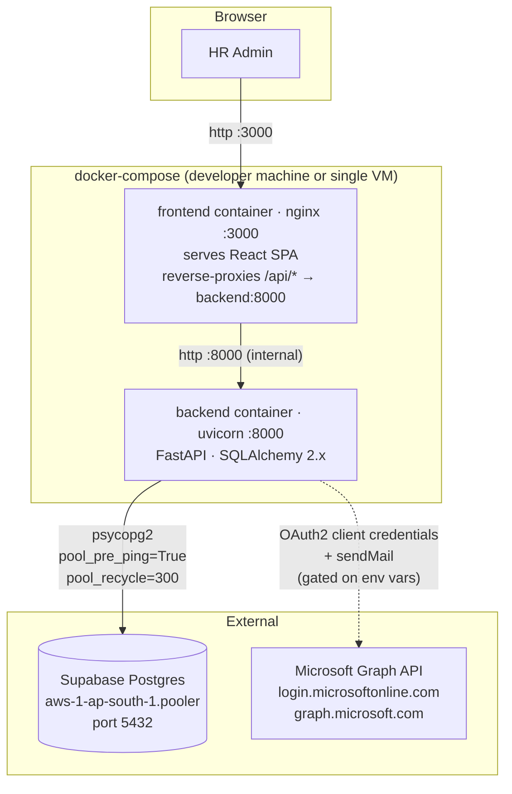
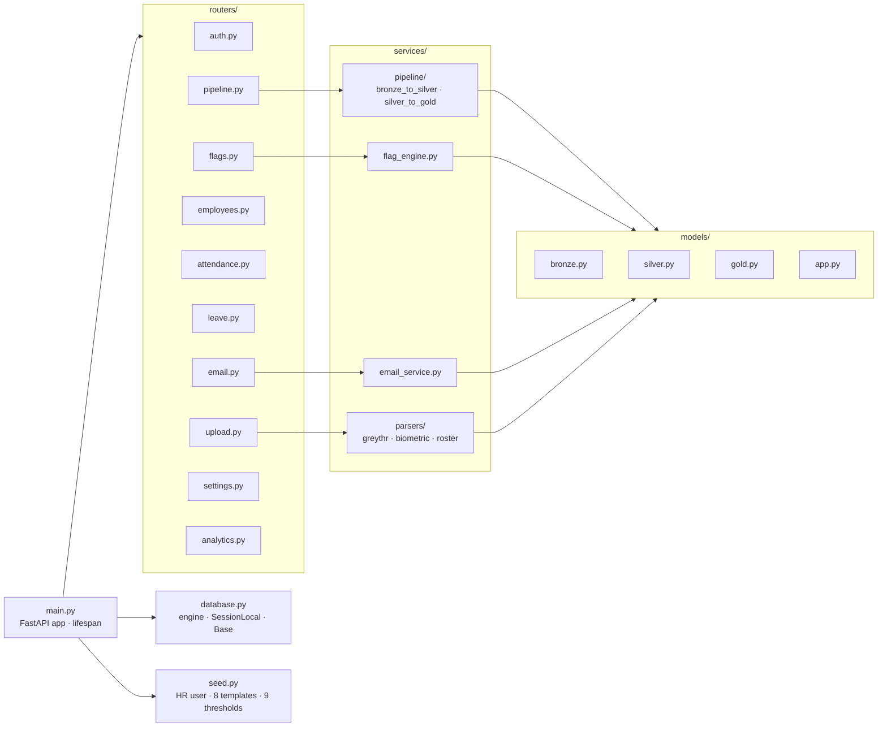
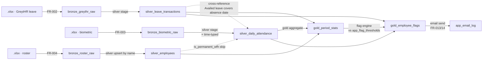
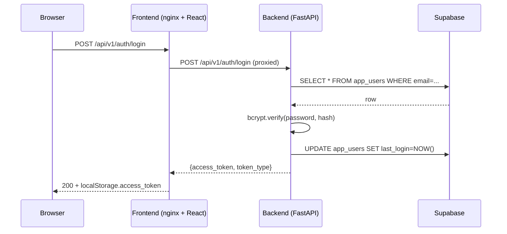
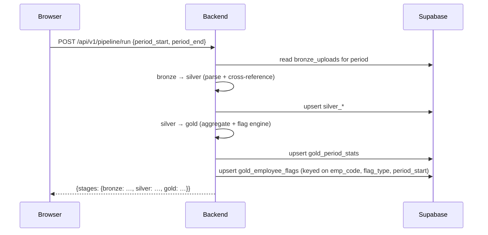
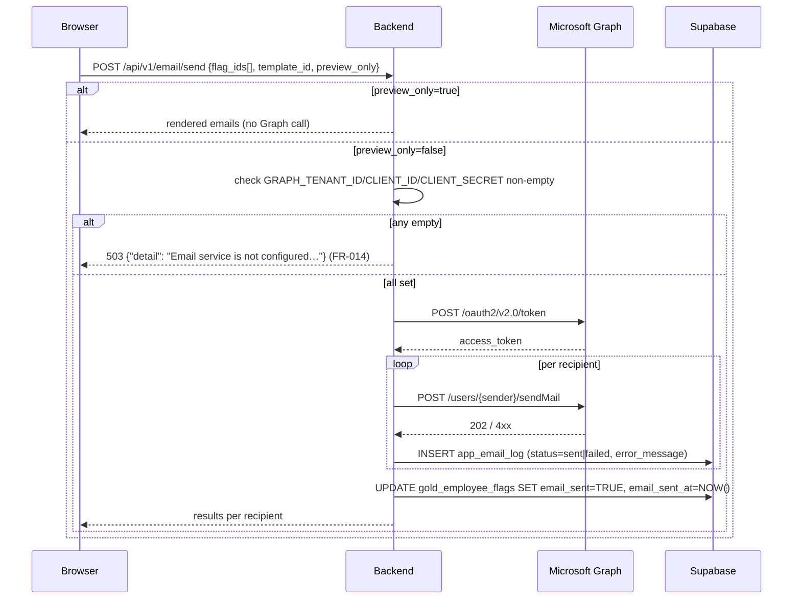

# Architecture

> Diagrams and runtime topology. Detailed requirements live in [PRD.md](PRD.md); detailed schema lives in [data-model.md](data-model.md). This document is the visual / structural complement, not a re-statement of those.

## Runtime topology

The compose file has **two services** — `backend` and `frontend`. There is intentionally no local Postgres container (Supabase is remote; see [ADR-001](decisions/ADR-001-no-alembic-and-no-local-db.md)).

## Backend module map

## Medallion data flow

Each transition is **idempotent**: re-running the pipeline for the same period must produce the same gold rows (FR-008, FR-009). The dedup key on `gold_employee_flags` is `(emp_code, flag_type, period_start)`.

## Request lifecycles

### Login (FR-001)

### Pipeline run (FR-018)

### Email send (FR-013, FR-014)

## Cross-cutting concerns

- **Auth.** JWT HS256, 24h. Every non-auth route depends on `get_current_user`. Frontend axios interceptor handles 401 → redirect.
- **Idempotency.** All silver/gold writes use `INSERT ... ON CONFLICT DO UPDATE` (or the SQLAlchemy ORM equivalent) keyed on the natural-key constraints listed in [data-model.md](data-model.md).
- **Errors.** API responses: `{"detail": "..."}` only — never a stack trace. Specific codes per [.claude/rules/api-design.md](../.claude/rules/api-design.md).
- **Observability.** Pipeline stage transitions log ISO timestamp + row counts to stdout (NFR-009). Failed uploads write the full error to `bronze_uploads.error_message`.

## Decision records

- [ADR-001 — No Alembic, no local DB container](decisions/ADR-001-no-alembic-and-no-local-db.md)

Add new ADRs as `docs/decisions/ADR-NNN-short-slug.md` and link them here.
