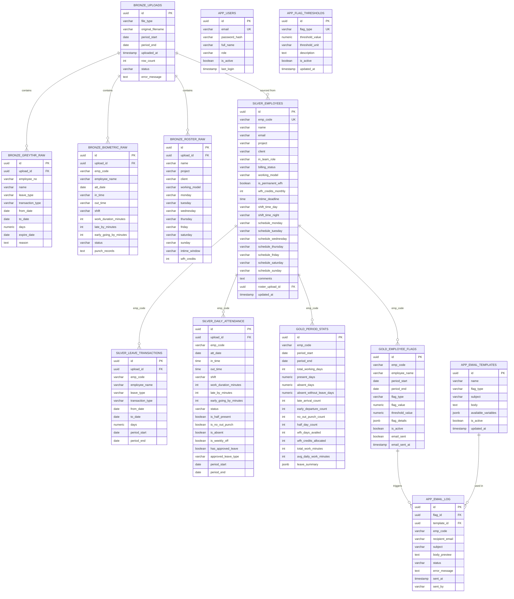

# Data Model

> Authoritative schema for the HR Compliance Dashboard. Mirrors PRD §15. Any deviation must be reflected back into the PRD before code changes.

## Storage engine
**PostgreSQL via Supabase (remote, managed).** Chosen to eliminate the local DB container — the single biggest historical source of first-run Docker errors — while keeping standard SQL semantics, JSONB support for `flag_details` / `leave_summary` / `available_variables`, and reliable timestamp handling.

## Entities

### bronze_uploads
- **Purpose:** One row per uploaded `.xlsx` file. Tracks ingest state and surfaces parse errors to the UI.
- **Fields:**
  - `id UUID PK` (Python `uuid4` default)
  - `file_type VARCHAR(20) NOT NULL` — `'greythr' | 'biometric' | 'roster'`
  - `original_filename VARCHAR(255)`
  - `period_start DATE NULLABLE`, `period_end DATE NULLABLE` (roster has no period)
  - `uploaded_at TIMESTAMP DEFAULT NOW()`
  - `row_count INTEGER`
  - `status VARCHAR(20) DEFAULT 'pending'` — `'pending' | 'processing' | 'processed' | 'failed'`
  - `error_message TEXT NULLABLE`
- **Relationships:** Parent of `bronze_greythr_raw`, `bronze_biometric_raw`, `bronze_roster_raw`, and `silver_employees.roster_upload_id`.
- **Lifecycle:** Created on upload → set `processing` → set `processed` or `failed` by parser. Duplicate-period uploads of the same `file_type` rejected with HTTP 409 before any insert.

### bronze_greythr_raw
- **Purpose:** Verbatim rows from GreytHR leave Excel (post Excel-serial conversion).
- **Fields:** `id UUID PK | upload_id UUID FK→bronze_uploads | sl_no INTEGER | employee_no VARCHAR(20) | name VARCHAR(150) | manager_no VARCHAR(20) | manager_name VARCHAR(150) | leave_type VARCHAR(100) | transaction_type VARCHAR(50) | posted_date TIMESTAMP | from_date DATE | to_date DATE | days NUMERIC(5,2) | expire_date DATE | reason TEXT | remarks TEXT | created_at TIMESTAMP DEFAULT NOW()`
- **Relationships:** Belongs to one `bronze_uploads`.
- **Lifecycle:** Written by GreytHR parser. Read by silver stage; never updated.

### bronze_biometric_raw
- **Purpose:** Verbatim daily attendance rows from biometric report (parsed from the block format).
- **Fields:** `id UUID PK | upload_id UUID FK | emp_code VARCHAR(20) | employee_name VARCHAR(150) | att_date DATE | in_time VARCHAR(10) | out_time VARCHAR(10) | shift VARCHAR(20) | scheduled_in_time VARCHAR(10) | scheduled_out_time VARCHAR(10) | work_duration_minutes INTEGER | ot_minutes INTEGER | total_duration_minutes INTEGER | late_by_minutes INTEGER | early_going_by_minutes INTEGER | status VARCHAR(60) | punch_records TEXT | created_at TIMESTAMP DEFAULT NOW()`
- **Relationships:** Belongs to one `bronze_uploads`.
- **Lifecycle:** Written by biometric parser. Time strings stored verbatim; conversion to `TIME` happens in silver.

### bronze_roster_raw
- **Purpose:** Verbatim roster rows including the typo column `"Intime window onpen till"`.
- **Fields:** `id UUID PK | upload_id UUID FK | name VARCHAR(150) | project VARCHAR(100) | client VARCHAR(50) | in_team_role VARCHAR(50) | billing_status VARCHAR(50) | working_model VARCHAR(50) | monday | tuesday | wednesday | thursday | friday | saturday | sunday VARCHAR(10) | intime_window VARCHAR(50) | shift_time_day VARCHAR(100) | shift_time_night VARCHAR(100) | comments TEXT | wfh_credits INTEGER | created_at TIMESTAMP DEFAULT NOW()`
- **Relationships:** Belongs to one `bronze_uploads`.
- **Lifecycle:** Written by roster parser. Read by silver upsert into `silver_employees`.

### silver_employees
- **Purpose:** Canonical employee record. One row per person, keyed by `emp_code` once matched to biometric data.
- **Fields:**
  - `id UUID PK`
  - `emp_code VARCHAR(20) UNIQUE NULLABLE` — may be NULL until matched with biometric data
  - `name VARCHAR(150) NOT NULL`, `email VARCHAR(150) NULLABLE` (HR-editable inline per FR-020)
  - `project | client | in_team_role | billing_status | working_model`
  - `is_permanent_wfh BOOLEAN DEFAULT FALSE` — derived from `working_model = 'Permanent WFH'` (FR-004, FR-007)
  - `wfh_credits_monthly INTEGER DEFAULT 4`
  - `intime_deadline TIME NULLABLE` — parsed from `"Intime window onpen till"`; NULL if not time-like
  - `shift_time_day | shift_time_night VARCHAR(100)`
  - `schedule_monday … schedule_sunday VARCHAR(10)` — `'WFO' | 'WFH' | 'Dayoff'`
  - `comments TEXT`
  - `roster_upload_id UUID FK→bronze_uploads NULLABLE`
  - `created_at`, `updated_at TIMESTAMP DEFAULT NOW()`
- **Relationships:** Logical parent (by `emp_code`) of `silver_leave_transactions`, `silver_daily_attendance`, `gold_period_stats`, `gold_employee_flags`.
- **Lifecycle:** Upserted on roster ingest, matched by normalized name (`" ".join(name.split())`, case-insensitive). `emp_code` filled when biometric data first appears for that name.

### silver_leave_transactions
- **Purpose:** Cleaned GreytHR leave rows joined into the period window for cross-referencing.
- **Fields:** `id UUID PK | upload_id UUID FK | emp_code | employee_name | manager_no | manager_name | leave_type | transaction_type | posted_date | from_date | to_date | days NUMERIC(5,2) | expire_date | reason | remarks | period_start | period_end | created_at`
- **Relationships:** Joined by `emp_code` (or name fallback) to `silver_employees` and `silver_daily_attendance`. Only `transaction_type = 'Availed'` rows feed the absence cross-reference (FR-006).
- **Lifecycle:** Written by silver stage from `bronze_greythr_raw`. Idempotent per upload.

### silver_daily_attendance
- **Purpose:** Cleaned daily attendance with time fields typed and derived booleans set.
- **Fields:** `id UUID PK | upload_id UUID FK | emp_code | employee_name | att_date | in_time TIME | out_time TIME | shift | scheduled_in_time | scheduled_out_time | work_duration_minutes | ot_minutes | total_duration_minutes | late_by_minutes | early_going_by_minutes | status VARCHAR(60) | is_half_present | is_no_out_punch | is_absent | is_weekly_off | has_approved_leave | approved_leave_type | period_start | period_end | created_at`
- **Constraints:** `UNIQUE (emp_code, att_date, upload_id)`.
- **Relationships:** Logical FK by `emp_code` to `silver_employees`.
- **Lifecycle:** Written by silver stage. `has_approved_leave` and `approved_leave_type` set by cross-referencing `silver_leave_transactions` Availed rows (FR-006). Cross-reference skipped for `is_permanent_wfh = True` employees (FR-007).

### gold_period_stats
- **Purpose:** Aggregated per-employee period metrics powering the dashboard and flag engine.
- **Fields:** `id UUID PK | emp_code | period_start | period_end | total_working_days | present_days NUMERIC(5,2) | absent_days | absent_without_leave_days | late_arrival_count | early_departure_count | no_out_punch_count | half_day_count | wfh_days_availed | wfh_credits_allocated | total_work_minutes | avg_daily_work_minutes | leave_summary JSONB | created_at`
- **Constraints:** `UNIQUE (emp_code, period_start, period_end)` — enforces pipeline idempotency (FR-008).
- **Relationships:** Logical FK by `emp_code` to `silver_employees`.
- **Lifecycle:** Upserted by gold stage. Re-running pipeline overwrites the same row.

### gold_employee_flags
- **Purpose:** One row per (emp_code, flag_type, period) when an evaluated flag fires.
- **Fields:** `id UUID PK | emp_code | employee_name | period_start | period_end | flag_type VARCHAR(60) | flag_value NUMERIC(8,2) | threshold_value NUMERIC(8,2) | flag_details JSONB | is_active BOOLEAN DEFAULT TRUE | email_sent BOOLEAN DEFAULT FALSE | email_sent_at TIMESTAMP NULLABLE | created_at`
- **De-dup key:** `(emp_code, flag_type, period_start)` — checked before insert (FR-009).
- **Relationships:** Parent of `app_email_log` via optional `flag_id`. Logical FK by `emp_code` to `silver_employees`.
- **Lifecycle:** Refreshed on every pipeline run — existing rows updated, no duplicates. HR may set `is_active = false` to resolve (FR-012). `email_sent` toggled by send flow (FR-013).

### app_users
- **Purpose:** Authentication store. Single HR admin in v1.
- **Fields:** `id UUID PK | email VARCHAR(150) UNIQUE NOT NULL | password_hash VARCHAR(255) NOT NULL | full_name | role VARCHAR(20) DEFAULT 'hr' | is_active BOOLEAN DEFAULT TRUE | created_at | last_login TIMESTAMP NULLABLE`
- **Seed:** If empty on startup, insert `hr@shorthills.ai` / bcrypt(`HR@ShortHills2024`) / role `hr` (FR-017).
- **Lifecycle:** Read by `/api/v1/auth/login`. `last_login` updated on successful auth.

### app_email_templates
- **Purpose:** Editable email templates with `{{variable}}` substitution.
- **Fields:** `id UUID PK | name VARCHAR(150) NOT NULL | flag_type VARCHAR(60) NULLABLE | subject VARCHAR(255) NOT NULL | body TEXT NOT NULL | available_variables JSONB | is_active BOOLEAN DEFAULT TRUE | created_at | updated_at`
- **Seed:** 8 default templates on startup (PRD §18.3): LATE_ARRIVAL, ABSENT_WITHOUT_LEAVE, CONSECUTIVE_ABSENCE, NO_OUT_PUNCH, WFH_QUOTA_EXCEEDED, WFO_VIOLATION, EARLY_DEPARTURE, HALF_DAY_FREQUENCY.
- **Lifecycle:** CRUD via Settings page (FR-015). Soft-delete (`is_active = false`) when referenced by `app_email_log` rows.

### app_flag_thresholds
- **Purpose:** Editable threshold per flag type. Powers the flag engine.
- **Fields:** `id UUID PK | flag_type VARCHAR(60) UNIQUE NOT NULL | threshold_value NUMERIC(8,2) NOT NULL | threshold_unit VARCHAR(20) | description TEXT | is_active BOOLEAN DEFAULT TRUE | updated_at`
- **Seed:** 9 rows on startup with defaults from PRD §17 (LATE_ARRIVAL=3, EARLY_DEPARTURE=3, ABSENT_WITHOUT_LEAVE=2, CONSECUTIVE_ABSENCE=2, NO_OUT_PUNCH=3, HALF_DAY_FREQUENCY=4, WFH_QUOTA_EXCEEDED=0, LOW_WORK_HOURS=300, WFO_VIOLATION=1).
- **Lifecycle:** HR edits via Settings (FR-016). Changes take effect on next pipeline run; existing flags not retroactively recomputed.

### app_email_log
- **Purpose:** Audit trail of every email send attempt.
- **Fields:** `id UUID PK | flag_id UUID FK→gold_employee_flags NULLABLE | template_id UUID FK→app_email_templates NULLABLE | emp_code | recipient_email | subject | body_preview | status VARCHAR(20) | error_message TEXT NULLABLE | sent_at TIMESTAMP NULLABLE | sent_by VARCHAR(150) | created_at`
- **Status values:** `'sent' | 'failed' | 'not_configured'`.
- **Relationships:** Optional FKs to the flag and template that triggered the send.
- **Lifecycle:** Insert-only. Drives Email History UI (FR-019).

## ERD

## Migration strategy
- **Engine:** PostgreSQL via Supabase (remote)
- **Schema management:** SQLAlchemy `Base.metadata.create_all(engine)` on startup. **No Alembic.** No migration files. The operation is idempotent — tables are created if absent, unchanged if present.
- **Seed data:** `seed.py` runs on startup: inserts default HR user, 8 email templates, 9 flag thresholds if tables are empty. Guarded by `if table.count == 0` check.
- **Rollback policy:** Not applicable (no migrations). Schema changes require a new deployment with updated SQLAlchemy models.
- **Naming:** No migration file naming convention — not used.

## Open questions
Carried from PRD §10:
- Azure AD flow for Microsoft Graph: Client Credentials assumed (app-only `Mail.Send`). To be confirmed when Graph is actually configured.
- Future PDF/Excel compliance report export — deferred.
- Mid-month roster changes — current model assumes the roster is static per month. Re-uploading the roster file overwrites silver_employees on matched name.
